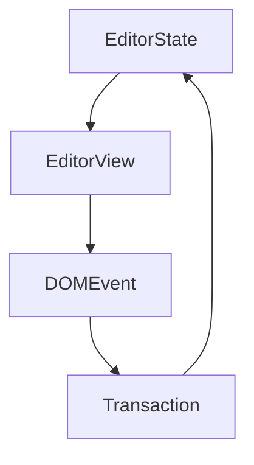

# Hi, welcome to Binderus!

Binderus is a user-first, cross-platform knowledge management app.

Binderus is designed to be a tool with a focus on simplicity
yet powerful for every daily use like writing, research, studying, collaboration, task and project management, etc.&#x20;

Here are some highlights of Binderus:

*   Simplicity 💖

*   Lightweight and fast! ⚡

*   Advanced visual editor (WYSIWYG - What You See Is What You Get) 👁

*   Support plain text and [Markdown](https://github.github.com/gfm/) with internal / external hyperlinks 🔗

*   You own your data and they are always portable. No lock-in 📦

*   It's like a "just right" mashup of Evernote, Notion, and WordPress minus the complexities ✨

*   Sync your notes to the cloud using Dropbox, OneDrive, Google Drive, etc. or Binderus Cloud ☁

Still have questions?

*   Join our [Discord](https://discord.gg/hqx7DSq8J6) channels

> Binderus has an advanced visual editor (WYSIWYG - What You See Is What You Get).

* Visual Editor
  * [x] 📝 **WYSIWYG Editor** - Write markdown in an elegant way. What is [Markdown](https://github.github.com/gfm/)?
  * [x] 🎮 **Customizable** - Support your awesome ideas by plugin
  * [x] 🦾 **Reliable** - Built on top of quality software components
  * [x] ⚡ **Slash & Tooltip** - Write fast for everyone, driven by plugin
  * [x] 🧮 **Math** - LaTeX math equations support, driven by plugin
  * [x] 📊 **Table** - Table support with fluent ui, driven by plugin
  * [x] 📰 **Diagram** - Diagram support with [mermaid](https://mermaid-js.github.io/mermaid/#/), driven by plugin
  * [x] 🍻 **Collaborate** - Shared editing support with [yjs](https://docs.yjs.dev/), driven by plugin
  * [x] 💾 **Clipboard** - Support copy and paste markdown, driven by plugin
  * [x] 👍 **Emoji** - Support emoji shortcut and picker, driven by plugin

***

You can add `inline code` and code block:

```javascript
function main() {
  console.log("Hello Binderus!");
}
```

> Tips: use `Mod-Enter` to exit blocks such as code block.

***

You can type `||` and a `space` to create a table:

| First Header   |    Second Header   |
| -------------- | :----------------: |
| Content Cell 1 |  Content Cell 1  |
| Content Cell 2 | **Content** Cell 2 |

***

Math is supported by [TeX expression](https://en.wikipedia.org/wiki/TeX).

Now we have some inline math: $E = mc^2$. You can click to edit it.

Math block is also supported.

$$
\begin{aligned}
T( (v_1 + v_2) \otimes w) &= T(v_1 \otimes w) + T(v_2 \otimes w) \\
T( v \otimes (w_1 + w_2)) &= T(v \otimes w_1) + T(v \otimes w_2) \\
T( (\alpha v) \otimes w ) &= T( \alpha ( v \otimes w) ) \\
T( v \otimes (\alpha w) ) &= T( \alpha ( v \otimes w) ) \\
\end{aligned}
$$

You can type `$$` and a `space` to create a math block.

***

Use [emoji cheat sheet](https://www.webfx.com/tools/emoji-cheat-sheet/) such as `:+1:` to add emoji[^1].

You may notice the emoji filter while inputting values, try to type `:baby` to see the list.

***

Diagrams is powered by [mermaid](https://mermaid-js.github.io/mermaid/#/).

You can type ` ```mermaid ` to add diagrams.



***

Have fun!

[^1]: We use [tweet emoji](https://twemoji.twitter.com) to make emojis viewable cross platforms.
